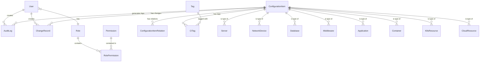

# CMDB 系统数据模型文档

## 1. 整体 ER 图



## 2. 核心实体说明

### 2.1 用户与权限模型

#### User (用户表)
| 字段 | 类型 | 约束 | 说明 |
|------|------|------|------|
| id | UUID | PRIMARY KEY | 用户唯一标识 |
| username | VARCHAR(50) | UNIQUE, NOT NULL | 用户名 |
| email | VARCHAR(100) | UNIQUE, NOT NULL | 邮箱 |
| password_hash | VARCHAR(255) | NOT NULL | 密码哈希 |
| full_name | VARCHAR(100) | | 全名 |
| role_id | UUID | FOREIGN KEY | 角色 ID |
| is_active | BOOLEAN | DEFAULT true | 是否激活 |
| created_at | TIMESTAMP | DEFAULT NOW() | 创建时间 |
| updated_at | TIMESTAMP | DEFAULT NOW() | 更新时间 |

#### Role (角色表)
| 字段 | 类型 | 约束 | 说明 |
|------|------|------|------|
| id | UUID | PRIMARY KEY | 角色唯一标识 |
| name | VARCHAR(50) | UNIQUE, NOT NULL | 角色名称 |
| code | VARCHAR(50) | UNIQUE, NOT NULL | 角色代码 |
| description | TEXT | | 角色描述 |
| is_system | BOOLEAN | DEFAULT false | 是否系统内置 |
| created_at | TIMESTAMP | DEFAULT NOW() | 创建时间 |

#### Permission (权限表)
| 字段 | 类型 | 约束 | 说明 |
|------|------|------|------|
| id | UUID | PRIMARY KEY | 权限唯一标识 |
| name | VARCHAR(100) | NOT NULL | 权限名称 |
| code | VARCHAR(100) | UNIQUE, NOT NULL | 权限代码 |
| resource | VARCHAR(50) | NOT NULL | 资源类型 |
| action | VARCHAR(20) | NOT NULL | 操作类型 (create/read/update/delete) |
| description | TEXT | | 权限描述 |

#### RolePermission (角色权限关联表)
| 字段 | 类型 | 约束 | 说明 |
|------|------|------|------|
| id | UUID | PRIMARY KEY | 唯一标识 |
| role_id | UUID | FOREIGN KEY, NOT NULL | 角色 ID |
| permission_id | UUID | FOREIGN KEY, NOT NULL | 权限 ID |
| created_at | TIMESTAMP | DEFAULT NOW() | 创建时间 |

### 2.2 配置项（CI）模型

#### ConfigurationItem (配置项基表)
| 字段 | 类型 | 约束 | 说明 |
|------|------|------|------|
| id | UUID | PRIMARY KEY | CI 唯一标识 |
| name | VARCHAR(200) | NOT NULL | CI 名称 |
| ci_type | VARCHAR(50) | NOT NULL | CI 类型 |
| code | VARCHAR(100) | UNIQUE | CI 编码 |
| status | VARCHAR(20) | DEFAULT 'active' | 状态 (active/inactive/deleted) |
| owner | VARCHAR(100) | | 负责人 |
| department | VARCHAR(100) | | 所属部门 |
| environment | VARCHAR(50) | | 环境 (prod/test/dev) |
| region | VARCHAR(50) | | 区域 |
| description | TEXT | | 描述 |
| attributes | JSONB | | 扩展属性 |
| version | INTEGER | DEFAULT 1 | 版本号 |
| created_by | UUID | FOREIGN KEY | 创建人 |
| created_at | TIMESTAMP | DEFAULT NOW() | 创建时间 |
| updated_at | TIMESTAMP | DEFAULT NOW() | 更新时间 |
| deleted_at | TIMESTAMP | | 删除时间（软删除） |

**索引设计:**
- `idx_ci_name`: name 字段模糊搜索
- `idx_ci_type`: ci_type 字段筛选
- `idx_ci_status`: status 字段筛选
- `idx_ci_environment`: environment 字段筛选
- `idx_ci_deleted_at`: deleted_at 字段（软删除查询）

#### Server (服务器配置项)
| 字段 | 类型 | 约束 | 说明 |
|------|------|------|------|
| id | UUID | PRIMARY KEY, FOREIGN KEY | 关联 ConfigurationItem.id |
| ci_id | UUID | UNIQUE, NOT NULL | CI ID |
| hostname | VARCHAR(200) | | 主机名 |
| ip_addresses | JSONB | | IP 地址列表 |
| os_type | VARCHAR(50) | | 操作系统类型 |
| os_version | VARCHAR(50) | | 操作系统版本 |
| cpu_cores | INTEGER | | CPU 核心数 |
| memory_gb | INTEGER | | 内存大小 (GB) |
| disk_gb | INTEGER | | 磁盘大小 (GB) |
| server_type | VARCHAR(50) | | 服务器类型 (physical/virtual/cloud) |
| cloud_provider | VARCHAR(50) | | 云服务商 |
| instance_id | VARCHAR(100) | | 云实例 ID |

#### NetworkDevice (网络设备)
| 字段 | 类型 | 约束 | 说明 |
|------|------|------|------|
| id | UUID | PRIMARY KEY, FOREIGN KEY | 关联 ConfigurationItem.id |
| ci_id | UUID | UNIQUE, NOT NULL | CI ID |
| device_type | VARCHAR(50) | | 设备类型 (switch/router/firewall/lb) |
| brand | VARCHAR(100) | | 品牌 |
| model | VARCHAR(100) | | 型号 |
| serial_number | VARCHAR(100) | | 序列号 |
| management_ip | VARCHAR(50) | | 管理 IP |
| ports | JSONB | | 端口配置 |
| firmware_version | VARCHAR(50) | | 固件版本 |

#### Database (数据库)
| 字段 | 类型 | 约束 | 说明 |
|------|------|------|------|
| id | UUID | PRIMARY KEY, FOREIGN KEY | 关联 ConfigurationItem.id |
| ci_id | UUID | UNIQUE, NOT NULL | CI ID |
| db_type | VARCHAR(50) | | 数据库类型 (mysql/postgresql/redis/mongodb) |
| version | VARCHAR(50) | | 版本 |
| host | VARCHAR(200) | | 主机地址 |
| port | INTEGER | | 端口 |
| instance_name | VARCHAR(100) | | 实例名称 |
| storage_gb | INTEGER | | 存储大小 (GB) |
| is_cluster | BOOLEAN | | 是否集群 |
| replication_mode | VARCHAR(50) | | 复制模式 |

#### Middleware (中间件)
| 字段 | 类型 | 约束 | 说明 |
|------|------|------|------|
| id | UUID | PRIMARY KEY, FOREIGN KEY | 关联 ConfigurationItem.id |
| ci_id | UUID | UNIQUE, NOT NULL | CI ID |
| middleware_type | VARCHAR(50) | | 类型 (nginx/tomcat/kafka/redis/etc) |
| version | VARCHAR(50) | | 版本 |
| host | VARCHAR(200) | | 主机地址 |
| port | INTEGER | | 端口 |
| config_path | VARCHAR(255) | | 配置文件路径 |
| log_path | VARCHAR(255) | | 日志文件路径 |

#### Application (应用程序)
| 字段 | 类型 | 约束 | 说明 |
|------|------|------|------|
| id | UUID | PRIMARY KEY, FOREIGN KEY | 关联 ConfigurationItem.id |
| ci_id | UUID | UNIQUE, NOT NULL | CI ID |
| app_type | VARCHAR(50) | | 应用类型 (web/api/service/job) |
| language | VARCHAR(50) | | 开发语言 |
| framework | VARCHAR(100) | | 框架 |
| version | VARCHAR(50) | | 版本 |
| git_repo | VARCHAR(255) | | Git 仓库地址 |
| deploy_path | VARCHAR(255) | | 部署路径 |
| health_check_url | VARCHAR(255) | | 健康检查 URL |

#### Container (容器)
| 字段 | 类型 | 约束 | 说明 |
|------|------|------|------|
| id | UUID | PRIMARY KEY, FOREIGN KEY | 关联 ConfigurationItem.id |
| ci_id | UUID | UNIQUE, NOT NULL | CI ID |
| container_id | VARCHAR(100) | | 容器 ID |
| image | VARCHAR(255) | | 镜像 |
| image_tag | VARCHAR(50) | | 镜像标签 |
| host_ip | VARCHAR(50) | | 宿主机 IP |
| ports | JSONB | | 端口映射 |
| cpu_request | VARCHAR(20) | | CPU 请求 |
| cpu_limit | VARCHAR(20) | | CPU 限制 |
| memory_request | VARCHAR(20) | | 内存请求 |
| memory_limit | VARCHAR(20) | | 内存限制 |
| status | VARCHAR(20) | | 容器状态 |

#### K8sResource (K8s 资源)
| 字段 | 类型 | 约束 | 说明 |
|------|------|------|------|
| id | UUID | PRIMARY KEY, FOREIGN KEY | 关联 ConfigurationItem.id |
| ci_id | UUID | UNIQUE, NOT NULL | CI ID |
| cluster_id | UUID | | 集群 ID |
| namespace | VARCHAR(100) | | 命名空间 |
| resource_type | VARCHAR(50) | | 资源类型 (pod/deployment/service/etc) |
| resource_name | VARCHAR(200) | | 资源名称 |
| uid | VARCHAR(100) | | K8s UID |
| labels | JSONB | | 标签 |
| annotations | JSONB | | 注解 |
| spec | JSONB | | 规格 |
| status | JSONB | | 状态 |

#### CloudResource (云资源)
| 字段 | 类型 | 约束 | 说明 |
|------|------|------|------|
| id | UUID | PRIMARY KEY, FOREIGN KEY | 关联 ConfigurationItem.id |
| ci_id | UUID | UNIQUE, NOT NULL | CI ID |
| cloud_provider | VARCHAR(50) | | 云服务商 (aliyun/aws/tencent) |
| resource_type | VARCHAR(50) | | 资源类型 (ecs/rds/slb/redis) |
| region | VARCHAR(50) | | 区域 |
| zone | VARCHAR(50) | | 可用区 |
| instance_id | VARCHAR(100) | | 云实例 ID |
| vpc_id | VARCHAR(100) | | VPC ID |
| security_groups | JSONB | | 安全组 |
| tags | JSONB | | 云标签 |
| pricing_type | VARCHAR(50) | | 计费类型 |
| expire_time | TIMESTAMP | | 到期时间 |

### 2.3 关系模型

#### ConfigurationItemRelation (CI 关系表)
| 字段 | 类型 | 约束 | 说明 |
|------|------|------|------|
| id | UUID | PRIMARY KEY | 关系唯一标识 |
| source_ci_id | UUID | FOREIGN KEY, NOT NULL | 源 CI ID |
| target_ci_id | UUID | FOREIGN KEY, NOT NULL | 目标 CI ID |
| relation_type | VARCHAR(50) | NOT NULL | 关系类型 |
| description | TEXT | | 关系描述 |
| created_by | UUID | FOREIGN KEY | 创建人 |
| created_at | TIMESTAMP | DEFAULT NOW() | 创建时间 |

**关系类型:**
- `depends_on`: 依赖于
- `connects_to`: 连接到
- `runs_on`: 运行于
- `hosted_on`: 托管于
- `contains`: 包含
- `belongs_to`: 属于

**索引设计:**
- `idx_relation_source`: source_ci_id 字段
- `idx_relation_target`: target_ci_id 字段
- `idx_relation_type`: relation_type 字段

### 2.4 标签模型

#### Tag (标签表)
| 字段 | 类型 | 约束 | 说明 |
|------|------|------|------|
| id | UUID | PRIMARY KEY | 标签唯一标识 |
| name | VARCHAR(50) | UNIQUE, NOT NULL | 标签名称 |
| color | VARCHAR(20) | | 标签颜色 |
| description | TEXT | | 标签描述 |
| created_at | TIMESTAMP | DEFAULT NOW() | 创建时间 |

#### CITag (CI 标签关联表)
| 字段 | 类型 | 约束 | 说明 |
|------|------|------|------|
| id | UUID | PRIMARY KEY | 唯一标识 |
| ci_id | UUID | FOREIGN KEY, NOT NULL | CI ID |
| tag_id | UUID | FOREIGN KEY, NOT NULL | 标签 ID |
| created_at | TIMESTAMP | DEFAULT NOW() | 创建时间 |

### 2.5 变更管理模型

#### ChangeRecord (变更记录表)
| 字段 | 类型 | 约束 | 说明 |
|------|------|------|------|
| id | UUID | PRIMARY KEY | 变更唯一标识 |
| ci_id | UUID | FOREIGN KEY, NOT NULL | CI ID |
| change_type | VARCHAR(50) | NOT NULL | 变更类型 (create/update/delete) |
| change_reason | TEXT | | 变更原因 |
| old_values | JSONB | | 变更前的值 |
| new_values | JSONB | | 变更后的值 |
| status | VARCHAR(20) | DEFAULT 'pending' | 状态 (pending/approved/rejected) |
| approver_id | UUID | FOREIGN KEY | 审批人 ID |
| approved_at | TIMESTAMP | | 审批时间 |
| created_by | UUID | FOREIGN KEY | 创建人 |
| created_at | TIMESTAMP | DEFAULT NOW() | 创建时间 |

**索引设计:**
- `idx_change_ci`: ci_id 字段
- `idx_change_type`: change_type 字段
- `idx_change_status`: status 字段
- `idx_change_created_at`: created_at 字段（时间范围查询）

### 2.6 审计模型

#### AuditLog (审计日志表)
| 字段 | 类型 | 约束 | 说明 |
|------|------|------|------|
| id | UUID | PRIMARY KEY | 日志唯一标识 |
| user_id | UUID | FOREIGN KEY | 用户 ID |
| action | VARCHAR(50) | NOT NULL | 操作类型 |
| resource_type | VARCHAR(50) | | 资源类型 |
| resource_id | UUID | | 资源 ID |
| request_method | VARCHAR(10) | | 请求方法 |
| request_path | VARCHAR(255) | | 请求路径 |
| request_body | JSONB | | 请求体 |
| response_status | INTEGER | | 响应状态码 |
| ip_address | VARCHAR(50) | | IP 地址 |
| user_agent | TEXT | | 用户代理 |
| created_at | TIMESTAMP | DEFAULT NOW() | 创建时间 |

**索引设计:**
- `idx_audit_user`: user_id 字段
- `idx_audit_action`: action 字段
- `idx_audit_resource`: resource_type 和 resource_id 组合索引
- `idx_audit_created_at`: created_at 字段（时间范围查询）

## 3. 数据字典

### 3.1 CI 类型枚举
```
server          - 服务器
network_device  - 网络设备
database        - 数据库
middleware      - 中间件
application     - 应用程序
container       - 容器
k8s_resource    - K8s 资源
cloud_resource  - 云资源
```

### 3.2 环境枚举
```
production  - 生产环境
staging     - 预发布环境
test        - 测试环境
development - 开发环境
```

### 3.3 状态枚举
```
active      - 活跃
inactive    - 非活跃
deleted     - 已删除 (软删除)
```

### 3.4 变更状态枚举
```
pending     - 待审批
approved    - 已批准
rejected    - 已拒绝
completed   - 已完成
```

## 4. 数据库初始化 SQL

```sql
-- 启用 UUID 扩展
CREATE EXTENSION IF NOT EXISTS "uuid-ossp";

-- 创建用户表
CREATE TABLE users (
    id UUID PRIMARY KEY DEFAULT uuid_generate_v4(),
    username VARCHAR(50) UNIQUE NOT NULL,
    email VARCHAR(100) UNIQUE NOT NULL,
    password_hash VARCHAR(255) NOT NULL,
    full_name VARCHAR(100),
    role_id UUID REFERENCES roles(id),
    is_active BOOLEAN DEFAULT true,
    created_at TIMESTAMP DEFAULT CURRENT_TIMESTAMP,
    updated_at TIMESTAMP DEFAULT CURRENT_TIMESTAMP
);

-- 创建角色表
CREATE TABLE roles (
    id UUID PRIMARY KEY DEFAULT uuid_generate_v4(),
    name VARCHAR(50) UNIQUE NOT NULL,
    code VARCHAR(50) UNIQUE NOT NULL,
    description TEXT,
    is_system BOOLEAN DEFAULT false,
    created_at TIMESTAMP DEFAULT CURRENT_TIMESTAMP
);

-- 创建权限表
CREATE TABLE permissions (
    id UUID PRIMARY KEY DEFAULT uuid_generate_v4(),
    name VARCHAR(100) NOT NULL,
    code VARCHAR(100) UNIQUE NOT NULL,
    resource VARCHAR(50) NOT NULL,
    action VARCHAR(20) NOT NULL,
    description TEXT
);

-- 创建角色权限关联表
CREATE TABLE role_permissions (
    id UUID PRIMARY KEY DEFAULT uuid_generate_v4(),
    role_id UUID NOT NULL REFERENCES roles(id),
    permission_id UUID NOT NULL REFERENCES permissions(id),
    created_at TIMESTAMP DEFAULT CURRENT_TIMESTAMP,
    UNIQUE(role_id, permission_id)
);

-- 创建配置项基表
CREATE TABLE configuration_items (
    id UUID PRIMARY KEY DEFAULT uuid_generate_v4(),
    name VARCHAR(200) NOT NULL,
    ci_type VARCHAR(50) NOT NULL,
    code VARCHAR(100) UNIQUE,
    status VARCHAR(20) DEFAULT 'active',
    owner VARCHAR(100),
    department VARCHAR(100),
    environment VARCHAR(50),
    region VARCHAR(50),
    description TEXT,
    attributes JSONB,
    version INTEGER DEFAULT 1,
    created_by UUID REFERENCES users(id),
    created_at TIMESTAMP DEFAULT CURRENT_TIMESTAMP,
    updated_at TIMESTAMP DEFAULT CURRENT_TIMESTAMP,
    deleted_at TIMESTAMP
);

-- 创建 CI 关系表
CREATE TABLE configuration_item_relations (
    id UUID PRIMARY KEY DEFAULT uuid_generate_v4(),
    source_ci_id UUID NOT NULL REFERENCES configuration_items(id),
    target_ci_id UUID NOT NULL REFERENCES configuration_items(id),
    relation_type VARCHAR(50) NOT NULL,
    description TEXT,
    created_by UUID REFERENCES users(id),
    created_at TIMESTAMP DEFAULT CURRENT_TIMESTAMP
);

-- 创建变更记录表
CREATE TABLE change_records (
    id UUID PRIMARY KEY DEFAULT uuid_generate_v4(),
    ci_id UUID NOT NULL REFERENCES configuration_items(id),
    change_type VARCHAR(50) NOT NULL,
    change_reason TEXT,
    old_values JSONB,
    new_values JSONB,
    status VARCHAR(20) DEFAULT 'pending',
    approver_id UUID REFERENCES users(id),
    approved_at TIMESTAMP,
    created_by UUID REFERENCES users(id),
    created_at TIMESTAMP DEFAULT CURRENT_TIMESTAMP
);

-- 创建审计日志表
CREATE TABLE audit_logs (
    id UUID PRIMARY KEY DEFAULT uuid_generate_v4(),
    user_id UUID REFERENCES users(id),
    action VARCHAR(50) NOT NULL,
    resource_type VARCHAR(50),
    resource_id UUID,
    request_method VARCHAR(10),
    request_path VARCHAR(255),
    request_body JSONB,
    response_status INTEGER,
    ip_address VARCHAR(50),
    user_agent TEXT,
    created_at TIMESTAMP DEFAULT CURRENT_TIMESTAMP
);

-- 创建索引
CREATE INDEX idx_ci_name ON configuration_items(name);
CREATE INDEX idx_ci_type ON configuration_items(ci_type);
CREATE INDEX idx_ci_status ON configuration_items(status);
CREATE INDEX idx_ci_environment ON configuration_items(environment);
CREATE INDEX idx_ci_deleted_at ON configuration_items(deleted_at);

CREATE INDEX idx_relation_source ON configuration_item_relations(source_ci_id);
CREATE INDEX idx_relation_target ON configuration_item_relations(target_ci_id);
CREATE INDEX idx_relation_type ON configuration_item_relations(relation_type);

CREATE INDEX idx_change_ci ON change_records(ci_id);
CREATE INDEX idx_change_type ON change_records(change_type);
CREATE INDEX idx_change_status ON change_records(status);
CREATE INDEX idx_change_created_at ON change_records(created_at);

CREATE INDEX idx_audit_user ON audit_logs(user_id);
CREATE INDEX idx_audit_action ON audit_logs(action);
CREATE INDEX idx_audit_resource ON audit_logs(resource_type, resource_id);
CREATE INDEX idx_audit_created_at ON audit_logs(created_at);
```
