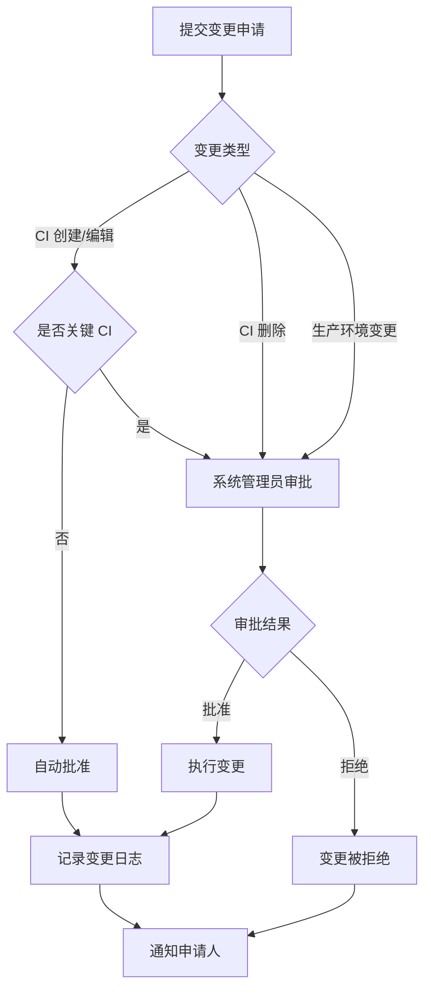

# CMDB 系统 RBAC 权限矩阵

## 1. 角色定义

### 1.1 角色列表

| 角色代码 | 角色名称 | 描述 | 使用场景 |
|----------|----------|------|----------|
| `super_admin` | 系统管理员 | 完整系统配置和管理权限 | 系统初始化、用户管理、角色配置、系统维护 |
| `ops_engineer` | 运维工程师 | 配置项 CRUD、变更执行权限 | 日常资源配置、变更执行、问题排查 |
| `readonly_user` | 只读用户 | 仅查看和搜索权限 | 资源查询、报表查看、审计查看 |
| `auditor` | 审计员 | 查看审计日志和变更历史权限 | 合规检查、审计追溯、变更记录审查 |

### 1.2 角色层级关系

```
┌─────────────────┐
│  super_admin    │ ← 系统管理员 (最高权限)
└────────┬────────┘
         │
    ┌────┴────┐
    │         │
┌───┴───┐  ┌──┴────┐
│  ops  │  │auditor│ ← 运维工程师、审计员 (专业权限)
└───┬───┘  └───┬───┘
    │          │
    └────┬─────┘
         │
    ┌────┴────┐
    │readonly │ ← 只读用户 (基础权限)
    └─────────┘
```

## 2. 权限定义

### 2.1 权限列表

| 权限代码 | 权限名称 | 资源类型 | 操作类型 | 描述 |
|----------|----------|----------|----------|------|
| `ci:create` | 创建配置项 | ci | create | 创建新的配置项 |
| `ci:read` | 查看配置项 | ci | read | 查看配置项列表和详情 |
| `ci:update` | 更新配置项 | ci | update | 修改配置项信息 |
| `ci:delete` | 删除配置项 | ci | delete | 删除配置项（软删除） |
| `ci:import` | 导入配置项 | ci | create | 批量导入配置项 |
| `ci:export` | 导出配置项 | ci | read | 批量导出配置项 |
| `relation:create` | 创建关系 | relation | create | 创建 CI 之间的关系 |
| `relation:read` | 查看关系 | relation | read | 查看 CI 关系图 |
| `relation:delete` | 删除关系 | relation | delete | 删除 CI 关系 |
| `change:create` | 创建变更 | change | create | 提交变更申请 |
| `change:read` | 查看变更 | change | read | 查看变更历史 |
| `change:approve` | 审批变更 | change | update | 审批变更申请 |
| `user:manage` | 用户管理 | user | crud | 管理用户账号 |
| `role:manage` | 角色管理 | role | crud | 管理角色权限 |
| `audit:read` | 查看审计 | audit | read | 查看审计日志 |
| `system:config` | 系统配置 | system | crud | 配置系统参数 |
| `sync:execute` | 执行同步 | sync | execute | 执行自动发现同步 |
| `report:view` | 查看报表 | report | read | 查看统计报表 |

## 3. 权限矩阵

### 3.1 功能权限矩阵

| 功能模块 | 功能点 | super_admin | ops_engineer | readonly_user | auditor |
|----------|--------|-------------|--------------|---------------|---------|
| **配置项管理** | 创建 CI | ✅ | ✅ | ❌ | ❌ |
| | 查看 CI | ✅ | ✅ | ✅ | ✅ |
| | 编辑 CI | ✅ | ✅ | ❌ | ❌ |
| | 删除 CI | ✅ | ⚠️ | ❌ | ❌ |
| | 批量导入 | ✅ | ✅ | ❌ | ❌ |
| | 批量导出 | ✅ | ✅ | ✅ | ✅ |
| | 搜索/过滤 | ✅ | ✅ | ✅ | ✅ |
| **关系管理** | 创建关系 | ✅ | ✅ | ❌ | ❌ |
| | 查看关系图 | ✅ | ✅ | ✅ | ✅ |
| | 删除关系 | ✅ | ✅ | ❌ | ❌ |
| | 影响分析 | ✅ | ✅ | ✅ | ✅ |
| **变更管理** | 提交变更 | ✅ | ✅ | ❌ | ❌ |
| | 查看变更 | ✅ | ✅ | ✅ | ✅ |
| | 审批变更 | ✅ | ❌ | ❌ | ❌ |
| | 变更对比 | ✅ | ✅ | ✅ | ✅ |
| **自动发现** | 配置同步任务 | ✅ | ❌ | ❌ | ❌ |
| | 执行同步 | ✅ | ⚠️ | ❌ | ❌ |
| | 查看同步结果 | ✅ | ✅ | ✅ | ✅ |
| **用户管理** | 用户 CRUD | ✅ | ❌ | ❌ | ❌ |
| | 角色分配 | ✅ | ❌ | ❌ | ❌ |
| **角色管理** | 角色 CRUD | ✅ | ❌ | ❌ | ❌ |
| | 权限配置 | ✅ | ❌ | ❌ | ❌ |
| **审计日志** | 查看审计日志 | ✅ | ⚠️ | ❌ | ✅ |
| | 导出审计日志 | ✅ | ❌ | ❌ | ✅ |
| **报表统计** | 查看仪表盘 | ✅ | ✅ | ✅ | ✅ |
| | 查看统计报表 | ✅ | ✅ | ✅ | ✅ |
| | 导出报表 | ✅ | ✅ | ✅ | ✅ |
| **系统配置** | 配置管理 | ✅ | ❌ | ❌ | ❌ |
| | 集成配置 | ✅ | ❌ | ❌ | ❌ |

**图例说明:**
- ✅: 完全允许
- ⚠️: 受限允许（需要审批或仅限自己创建的资源）
- ❌: 禁止

### 3.2 API 权限映射

| API 端点 | 方法 | 所需权限 | 允许的角色 |
|----------|------|----------|------------|
| `/api/ci` | POST | `ci:create` | super_admin, ops_engineer |
| `/api/ci` | GET | `ci:read` | all |
| `/api/ci/:id` | GET | `ci:read` | all |
| `/api/ci/:id` | PUT | `ci:update` | super_admin, ops_engineer |
| `/api/ci/:id` | DELETE | `ci:delete` | super_admin |
| `/api/ci/batch/import` | POST | `ci:import` | super_admin, ops_engineer |
| `/api/ci/batch/export` | GET | `ci:export` | all |
| `/api/ci/:id/relations` | POST | `relation:create` | super_admin, ops_engineer |
| `/api/ci/:id/relations` | GET | `relation:read` | all |
| `/api/ci/relations/:id` | DELETE | `relation:delete` | super_admin, ops_engineer |
| `/api/changes` | POST | `change:create` | super_admin, ops_engineer |
| `/api/changes` | GET | `change:read` | all |
| `/api/changes/:id/approve` | POST | `change:approve` | super_admin |
| `/api/users` | POST | `user:manage` | super_admin |
| `/api/users` | GET | `user:manage` | super_admin |
| `/api/roles` | POST | `role:manage` | super_admin |
| `/api/roles/:id/permissions` | PUT | `role:manage` | super_admin |
| `/api/audit-logs` | GET | `audit:read` | super_admin, auditor |
| `/api/reports/*` | GET | `report:view` | all |
| `/api/sync/execute` | POST | `sync:execute` | super_admin |
| `/api/system/config` | GET/PUT | `system:config` | super_admin |

## 4. 数据权限规则

### 4.1 数据范围控制

| 角色 | 数据范围 | 说明 |
|------|----------|------|
| super_admin | 全部数据 | 可以访问所有配置项和数据 |
| ops_engineer | 负责的配置项 | 只能编辑自己负责的 CI，可以查看所有 CI |
| readonly_user | 全部数据（只读） | 可以查看所有配置项，但不能修改 |
| auditor | 全部数据（只读 + 审计） | 可以查看所有配置项和审计日志 |

### 4.2 环境权限控制

```yaml
# 环境权限配置示例
environments:
  production:
    allowed_roles: [super_admin, ops_engineer, readonly_user, auditor]
    write_roles: [super_admin, ops_engineer]
    delete_roles: [super_admin]  # 生产环境删除需要超级管理员
  staging:
    allowed_roles: [super_admin, ops_engineer, readonly_user, auditor]
    write_roles: [super_admin, ops_engineer]
    delete_roles: [super_admin, ops_engineer]
  development:
    allowed_roles: [super_admin, ops_engineer, readonly_user, auditor]
    write_roles: [super_admin, ops_engineer]
    delete_roles: [super_admin, ops_engineer]
```

## 5. 变更审批流程

### 5.1 变更审批矩阵

| 变更类型 | 影响范围 | 审批人 | 审批层级 |
|----------|----------|--------|----------|
| CI 创建 | 无 | 自动批准 | 0 级 |
| CI 编辑（非关键） | 单 CI | 自动批准 | 0 级 |
| CI 编辑（关键） | 单 CI | 系统管理员 | 1 级 |
| CI 删除 | 单 CI | 系统管理员 | 1 级 |
| CI 批量操作 | >10 个 CI | 系统管理员 | 1 级 |
| 关系变更 | 单关系 | 自动批准 | 0 级 |
| 生产环境变更 | 生产 CI | 系统管理员 | 1 级 |

### 5.2 审批流程图



## 6. 审计规则

### 6.1 审计事件类型

| 事件类别 | 事件类型 | 审计内容 | 保留期限 |
|----------|----------|----------|----------|
| 认证事件 | 登录成功/失败 | 用户、IP、时间、结果 | 180 天 |
| 认证事件 | 登出 | 用户、IP、时间 | 180 天 |
| 认证事件 | Token 刷新 | 用户、IP、时间 | 180 天 |
| 配置项事件 | CI 创建 | 用户、CI 信息、时间 | 365 天 |
| 配置项事件 | CI 更新 | 用户、变更内容、时间 | 365 天 |
| 配置项事件 | CI 删除 | 用户、CI 信息、时间 | 365 天 |
| 关系事件 | 关系创建/删除 | 用户、关系信息、时间 | 365 天 |
| 变更事件 | 变更申请 | 用户、变更内容、时间 | 365 天 |
| 变更事件 | 变更审批 | 用户、审批结果、时间 | 365 天 |
| 权限事件 | 用户创建/删除 | 用户、目标用户、时间 | 365 天 |
| 权限事件 | 角色分配 | 用户、目标用户、角色、时间 | 365 天 |
| 系统事件 | 配置修改 | 用户、配置项、时间 | 365 天 |
| 系统事件 | 同步执行 | 用户、同步类型、结果、时间 | 180 天 |

### 6.2 审计日志字段

```json
{
  "id": "uuid",
  "user_id": "uuid",
  "username": "string",
  "action": "string",
  "resource_type": "string",
  "resource_id": "uuid",
  "request_method": "string",
  "request_path": "string",
  "request_body": {},
  "response_status": 200,
  "ip_address": "string",
  "user_agent": "string",
  "created_at": "timestamp"
}
```

## 7. 权限实现

### 7.1 权限中间件

```python
# 权限检查中间件示例
from fastapi import Request, HTTPException, status
from functools import wraps

def require_permission(permission_code: str):
    """权限检查装饰器"""
    def decorator(func):
        @wraps(func)
        async def wrapper(request: Request, *args, **kwargs):
            user = request.state.user
            if not user:
                raise HTTPException(
                    status_code=status.HTTP_401_UNAUTHORIZED,
                    detail="未授权"
                )

            # 检查用户是否有指定权限
            has_permission = await check_user_permission(user.id, permission_code)
            if not has_permission:
                raise HTTPException(
                    status_code=status.HTTP_403_FORBIDDEN,
                    detail="权限不足"
                )

            return await func(request, *args, **kwargs)
        return wrapper
    return decorator
```

### 7.2 角色权限初始化

```python
# 系统初始化时的角色权限配置
INITIAL_ROLES = [
    {
        "code": "super_admin",
        "name": "系统管理员",
        "permissions": ["*"]  # 所有权限
    },
    {
        "code": "ops_engineer",
        "name": "运维工程师",
        "permissions": [
            "ci:create", "ci:read", "ci:update",
            "relation:*", "change:create", "change:read",
            "report:view", "sync:execute"
        ]
    },
    {
        "code": "readonly_user",
        "name": "只读用户",
        "permissions": [
            "ci:read", "relation:read",
            "change:read", "report:view"
        ]
    },
    {
        "code": "auditor",
        "name": "审计员",
        "permissions": [
            "ci:read", "relation:read",
            "change:read", "audit:read",
            "report:view", "ci:export"
        ]
    }
]
```

## 8. 安全最佳实践

### 8.1 权限最小化原则
- 用户只应拥有完成工作所需的最小权限
- 定期审查和清理不必要的权限
- 敏感操作需要额外的权限验证

### 8.2 权限变更审计
- 所有权限变更必须记录审计日志
- 权限变更需要系统管理员审批
- 定期生成权限变更报告

### 8.3 会话管理
- JWT Token 有效期 24 小时
- 支持 Token 刷新机制
- 支持强制登出（Token 黑名单）

### 8.4 密码策略
- 最小长度 8 位
- 包含大小写字母、数字、特殊字符
- 密码加密存储（bcrypt）
- 支持密码过期策略
